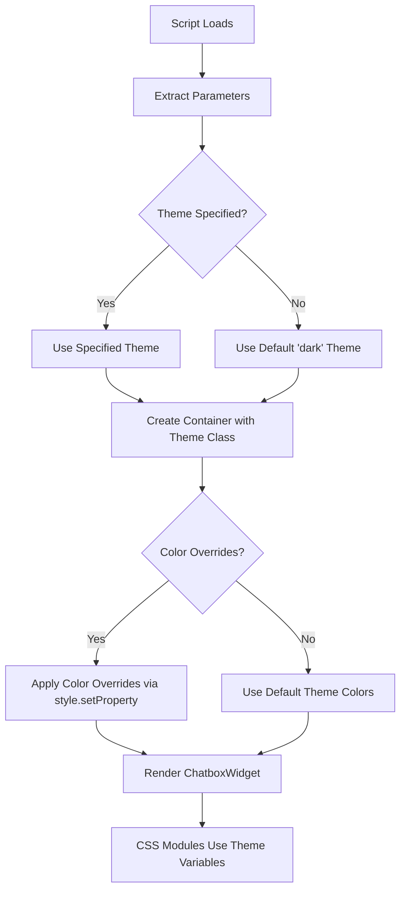

# Detailed Plan: CSS Module Variables with Theme Support

## Current Understanding

1. You have a chatbox widget that supports light and dark themes
2. The theme is set via a script parameter when the widget initializes
3. You want to use CSS variables like `--neutral-3` in your CSS modules without having to specify `-light` or `-dark` suffix
4. You want to allow customers to override specific color variables via script parameters
5. These overrides should merge with the existing theme rather than replace it entirely
6. You prefer creating dynamic CSS variables at runtime by setting them on the container element using element.style.setProperty()

## Implementation Plan



### 1. Update the ScriptParams Interface

First, we need to update the ScriptParams interface in `types.ts` to include the theme and color overrides:

```typescript
export interface ScriptParams {
  agentId: string | null; // Fleek agent ID from script tag
  apiKey: string | null; // API key for BE proxy
  theme?: 'light' | 'dark'; // Theme selection
  colors?: Record<string, string>; // Color overrides
}
```

### 2. Update the getScriptParams Function

Modify the `getScriptParams` function in `utils.ts` to extract the theme and color overrides from the script parameters:

```typescript
export function getScriptParams(): ScriptParams {
  try {
    const script = (document.currentScript ||
      document.querySelector(
        'script[src*="chatbox.js"]'
      )) as HTMLScriptElement | null;
    if (!script) {
      console.error('No script tag found for chatbox.js');
      return { agentId: null, apiKey: null };
    }
    const url = new URL(script.src);
    const params: ScriptParams = {
      agentId: url.searchParams.get('agentId'),
      apiKey: url.searchParams.get('apiKey'),
      theme: (url.searchParams.get('theme') as 'light' | 'dark') || 'dark',
    };

    // Parse color overrides if provided
    const colorsParam = url.searchParams.get('colors');
    if (colorsParam) {
      try {
        params.colors = JSON.parse(decodeURIComponent(colorsParam));
      } catch (e) {
        console.error('Error parsing colors parameter:', e);
      }
    }

    console.log('Script params:', params);
    return params;
  } catch (e) {
    console.error('Error parsing script params:', e);
    return { agentId: null, apiKey: null };
  }
}
```

### 3. Create a Function to Apply Color Overrides

Add a new function to `utils.ts` to apply color overrides to the container element:

```typescript
export function applyColorOverrides(
  container: HTMLElement,
  colors: Record<string, string>
): void {
  Object.entries(colors).forEach(([key, value]) => {
    // Apply the color override as a CSS variable
    container.style.setProperty(`--${key}`, value);
    console.log(`Applied color override: --${key}: ${value}`);
  });
}
```

### 4. Update the ChatboxWidget Props

Update the `ChatboxWidget` component props to include theme and colors:

```typescript
interface ChatboxWidgetProps {
  agentId: string;
  apiKey: string;
  theme?: 'light' | 'dark';
  colors?: Record<string, string>;
}
```

### 5. Modify the chatbox.ts Initialization

Update the initialization in `chatbox.ts` to pass theme and colors to the ChatboxWidget and apply color overrides:

```typescript
document.addEventListener('DOMContentLoaded', () => {
  console.log('DOM fully loaded');

  const { agentId, apiKey, theme = 'dark', colors } = getScriptParams();

  if (!agentId || !apiKey) {
    console.error(
      'Fleek Chatbox: Missing agentId or apiKey in script parameters. Cannot initialize.'
    );
    return;
  }

  const container = document.createElement('div');
  container.id = 'fleek-chatbox-container';
  container.classList.add(theme);
  document.body.appendChild(container);

  // Apply color overrides if provided
  if (colors && Object.keys(colors).length > 0) {
    applyColorOverrides(container, colors);
  }

  console.log(
    `Initializing ChatboxWidget with agentId: ${agentId}, theme: ${theme}`
  );
  render(h(ChatboxWidget, { agentId, apiKey, theme, colors }), container);
});
```

### 6. Ensure CSS Variables are Properly Structured in global.css

The current structure in `global.css` is already good, with `.light` and `.dark` classes setting the appropriate variables. This allows you to use variables like `--neutral-3` in your CSS modules without having to specify `-light` or `-dark` suffix.

### 7. Example Usage in CSS Modules

Now you can use the theme variables directly in your CSS modules:

```css
.myComponent {
  background-color: var(--neutral-3);
  color: var(--accent-9);
  border: 1px solid var(--warning-6);
}
```

### 8. Documentation for Customers

Create documentation explaining how customers can customize colors:

```html
<script src="https://your-domain.com/chatbox.js?agentId=your-agent-id&apiKey=your-api-key&theme=light&colors=%7B%22accent-9%22%3A%22%23ff0000%22%2C%22neutral-3%22%3A%22%23f5f5f5%22%7D"></script>
```

This example sets the theme to light and overrides `accent-9` to red and `neutral-3` to a light gray. The `colors` parameter is a URL-encoded JSON object.

## Implementation Sequence

1. Update the types.ts file with the new ScriptParams interface
2. Modify the utils.ts file to extract theme and colors from script parameters
3. Add the applyColorOverrides function to utils.ts
4. Update the ChatboxWidget component props
5. Modify the chatbox.ts initialization to handle theme and color overrides
6. Test with different themes and color overrides
7. Create documentation for customers

## Testing Plan

1. Test with default theme (no theme parameter)
2. Test with explicit light theme
3. Test with explicit dark theme
4. Test with color overrides for various variables
5. Test with invalid color overrides (should fallback gracefully)
6. Test in different browsers to ensure compatibility
